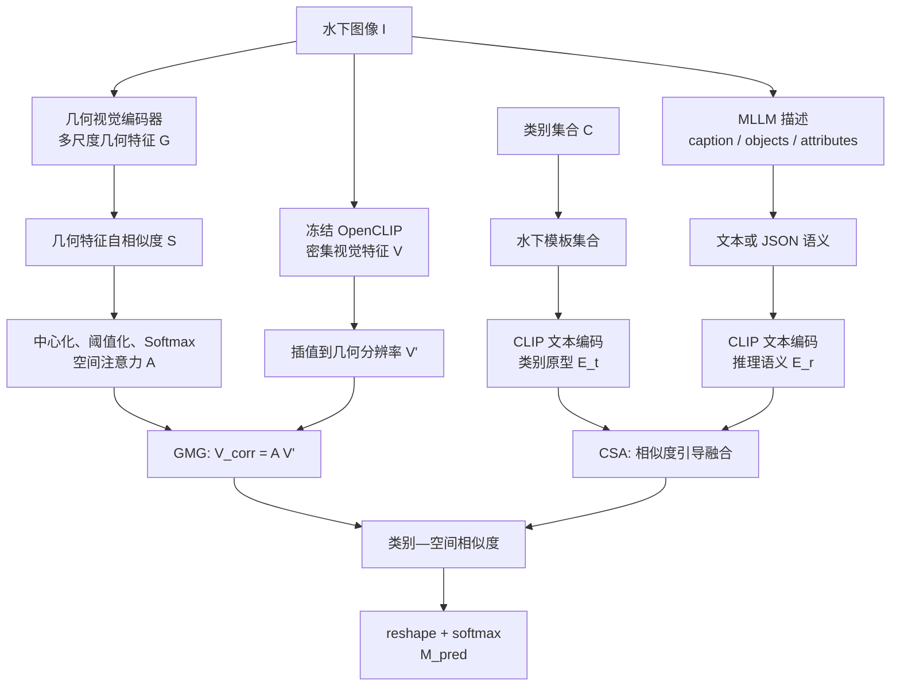

# Earth2Ocean（E2O）：论文整理版

论文题名：*Exploring the underwater world segmentation without extra training*。论文把方法称为 **Earth2Ocean（E2O）**，目标是让冻结的视觉语言模型在水下开放词汇语义分割（OVSS）上工作，不在水下数据上更新参数。

## 1. 论文到底要解决什么

陆地图像上预训练的 CLIP/OpenCLIP 在水下会遇到两个相互关联的问题：

1. **视觉表征偏移**：浑浊、散射、颜色衰减、低照度和运动模糊会破坏图像特征中的局部结构。
2. **文本—视觉语义错位**：`a photo of a {class}.` 这样的陆地通用模板对水下环境、栖息地、尺度和外观条件的表达有限。

E2O 在推理阶段分别修正两条分支，不引入水下适配器训练：

- **GMG（Geometric Mask Generator）**：用几何视觉特征的空间自相似度构造注意力矩阵，修正 CLIP 的密集视觉特征。
- **CSA（Context and Semantic Alignment）**：用水下场景提示词建立类别文本原型，再用 MLLM 提取水下语义并在 CLIP 文本空间中融合。

最后通过修正后的视觉特征与融合后的类别文本特征做相似度，得到每个像素/patch 的类别预测。

## 2. 任务定义与术语

### 2.1 OVSS 的输入和输出

给定图像 $I$、开放类别集合 $C=\{c_1,\ldots,c_K\}$，模型要输出每个类别在每个空间位置上的分数：

$$
I\in\mathbb{R}^{H_0\times W_0\times 3},\qquad
C=\{c_1,\ldots,c_K\},
$$

$$
M^{\mathrm{pred}}\in\mathbb{R}^{K\times H_0\times W_0}.
$$

这里的“开放词汇”指类别由文本定义，测试类别可以不属于训练过的固定分类头。E2O 的主实验使用数据集给出的类别名称构造文本输入。

### 2.2 三种 mask 的角色

| 名称 | 出现位置 | 实际含义 |
|---|---|---|
| GMG 的“mask generator”输出 | E2O | 由几何自相似度得到的空间注意力/特征传播机制，最终形成密集类别图 |
| SAM2/SLIC 的区域 mask | TextRegion | 对图像区域的软分配，用于区域 token 或 mask pooling |
| 最终类别 mask | OVSS 输出 | 每个类别对应的像素或空间位置预测 |

**Inference**：E2O 的核心代数路径是 `几何自相似度 → V_corr → 文本相似度`；TextRegion 则沿着 `区域 mask → region token → 文本相似度` 展开。

## 3. 数据集和基准贡献

### 3.1 AquaOV255

**Evidence**：论文报告 AquaOV255 含 20,723 张高分辨率水下图像、255 个类别，并覆盖鱼类、珊瑚、海洋植物、潜水相关物体等水下概念。

### 3.2 UOVSBench

UOVSBench 把 AquaOV255 与已有水下分割数据集合并，用于评估跨数据集、跨类别的开放词汇水下分割。主表中出现的组成数据集包括：

- AquaOV255
- USIS16K
- SUIM
- MAS3K
- USIS10K
- DUT-USEG（主表中有时缩写为 DUT-Seg）

> [!note] 类别数的核对事项
> 正文把 AquaOV255 表述为“255 categories including background”，而补充材料的类别编号表看起来从 1 到 254。当前笔记保留论文的主张，不自行改写数字；正式实验前应以发布代码中的类别列表、背景索引和评测脚本为准。

### 3.3 固定分割数据转成 OVSS 评测的逻辑

如果已有数据集提供固定类别和像素标签，可以按以下方式构造 OVSS 输入：

1. 把数据集中的类别 ID 映射成可读类别名。
2. 用类别名填入一组水下模板，得到类别文本 embedding。
3. 保留原始像素标注作为评测真值。
4. 对每个空间位置计算视觉特征与类别文本特征的相似度。
5. reshape/resize 成类别概率图，再计算 mIoU、mAcc 和 aAcc。

## 4. E2O 总流程：先看图，再看公式



论文中的方法示意图（保留自原始笔记）：


### 4.1 流程—公式对照表

| 流程步骤 | 输入 | 关键计算 | 输出 |
|---|---|---|---|
| ① 视觉分支 | 图像 $I$ | $V=\mathrm{CLIP}_{1:L-1}(I)$ | 密集视觉 token $V$ |
| ② 几何先验 | 几何特征 $G^{L_g}$ | $S=\hat G^\top\hat G$ | 空间自相似度矩阵 $S$ |
| ③ GMG 修正 | $S,V$ | 中心化、截断、Softmax、$V_{corr}=AV'$ | 几何引导视觉特征 |
| ④ 水下类别文本 | 类别名、模板 | $E_t=\frac1P\sum_p E_{t,p}$ | 类别原型 $E_t$ |
| ⑤ MLLM 语义 | 图像、类别列表或离线类别知识 | 描述 → CLIP text encoder | $E_r$ |
| ⑥ CSA 融合 | $E_t,E_r$ | 相似度 $s$、门控权重 $w$ | $E_{fused}$ |
| ⑦ 密集分类 | $V_{corr},E_{fused}$ | $Z=E_{fused}V_{corr}^{\top}$ | 类别图 $M^{pred}$ |

## 5. GMG：几何自相似度怎样修正视觉特征

### 5.1 直觉

CLIP 的全局语义能力很强，但直接拿它的 patch 特征做像素级分类时，水下退化可能导致相邻位置的视觉表示不稳定。几何编码器提供相对更稳定的空间结构信息；GMG 不把几何特征直接当成类别特征，而是把它们的**相互关系**变成一个空间传播权重。

**Inference**：GMG 的作用可以理解为“让视觉 token 按照几何上相似的位置相互传递信息”，从而减少局部噪声和水下外观变化带来的破碎预测。

### 5.2 逐步计算

#### Step 1：提取 CLIP 密集视觉特征

论文把 CLIP 视觉编码器前 $L-1$ 个阶段的输出记为：

$$
V=\mathrm{CLIP}_{1:L-1}(I)\in\mathbb{R}^{N_v\times C},
\qquad N_v=H_vW_v.
$$

这里的 $H_v,W_v$ 是视觉特征图的空间尺寸，不一定等于原图的 $H_0,W_0$；$C$ 是 CLIP embedding 通道数。

#### Step 2：提取多尺度几何特征

几何编码器产生多尺度特征：

$$
G=\{G^l\}_{l=0}^{L_g},
\qquad
G^l\in\mathbb{R}^{H_g\times W_g\times C_g}.
$$

GMG 使用最后一级几何特征，并把它变成列 token：

$$
\hat G=\mathrm{reshape}(G^{L_g})
\in\mathbb{R}^{C_g\times N_g},
\qquad N_g=H_gW_g.
$$

论文把这一支描述为 geometric encoder / geometric-DINO features，并说明几何编码器沿用相关工作的设计。

#### Step 3：计算几何自相似度

$$
S=\hat G^{\top}\hat G
\in\mathbb{R}^{N_g\times N_g}.
$$

其中 $S_{ij}$ 表示几何位置 $i$ 和位置 $j$ 的相似程度。它是位置—位置矩阵，不是类别—位置矩阵。

#### Step 4：中心化、缩放和截断

令所有元素的均值为：

$$
\bar S=\frac{1}{N_g^2}\sum_{i=1}^{N_g}\sum_{j=1}^{N_g}S_{ij}.
$$

论文的中心化和缩放可写成：

$$
\widetilde S=\gamma\left(S-\beta\bar S\right),
$$

其中 $\beta$ 控制中心位置，$\gamma$ 控制相似度的温度/放大程度。随后把负值截断，保留有效连接：

$$
\widetilde S^{+}_{ij}=\begin{cases}
\widetilde S_{ij},&\widetilde S_{ij}\ge 0,\\
-\infty,&\widetilde S_{ij}<0.
\end{cases}
$$

按行 Softmax 得到空间注意力：

$$
A=\mathrm{Softmax}_{\mathrm{row}}(\widetilde S^{+})
\in\mathbb{R}^{N_g\times N_g}.
$$

这一步把几何分布/自相似度转成可传播权重，形成 GMG 的传播矩阵。

#### Step 5：传播 CLIP 视觉特征

先把 CLIP 特征图插值到几何分支的分辨率：

$$
V'=\mathrm{Interpolate}(V)\in\mathbb{R}^{N_g\times C}.
$$

最后由几何注意力传播视觉 token：

$$
V_{corr}=A V'
\in\mathbb{R}^{N_g\times C}.
$$

因此，GMG 并没有把 $G$ 和 $V$ 在通道维度简单拼接；它用 $G$ 决定“哪些空间位置之间可以传递信息”，被传播的内容仍然是 CLIP 的视觉特征 $V'$。

### 5.3 GMG 的计算推理

对输出位置 $i$，有：

$$
V_{corr,i}=\sum_{j=1}^{N_g}A_{ij}V'_j.
$$

也就是说，位置 $i$ 的新特征是所有位置视觉特征的加权和，权重由几何自相似度决定。若水下图像中同一目标的不同部分在几何空间上相似，则它们可以互相补充；若两个位置几何上不相似，负值截断后它们之间的传播会被压低或切断。

## 6. CSA：水下提示词、MLLM 和类别文本怎样融合

CSA 将多种文字信息重新编码到 CLIP 的文本空间，再与视觉空间对齐；MLLM 的隐藏视觉向量不参与这条直接拼接路径。

### 6.1 水下场景模板

对每个类别 $c_t$，准备 $P$ 个水下模板，例如：

```text
A photo of a {class} underwater.
{class} swimming near a coral reef.
A close-up underwater photo of a {class} in turbid water.
```

用冻结的 CLIP 文本编码器得到：

$$
E_t^{\mathrm{raw}}\in\mathbb{R}^{K\times P\times C}.
$$

对同一类别的模板做平均：

$$
E_t=\frac1P\sum_{p=1}^{P}E_t^{\mathrm{raw}}[:,p,:]
\in\mathbb{R}^{K\times C}.
$$

这里 $E_t[t,:]$ 是类别 $c_t$ 的水下文本原型。完整的模板按“基础、场景、成像、交互、外观、环境”分组，见 [E2O-水下提示词库](/lun-wen-bi-ji/e2o-水下提示词库/)。

**Inference**：模板平均不增加模型参数，而是把“类别是什么”从一个孤立名词扩展成一组水下条件下的语言描述，降低单个 prompt 选择的影响。

### 6.2 MLLM 到底描述什么

论文主文给出的 MLLM 任务是：给定图像和允许的类别列表，生成三类信息：

1. 一句简洁的英文 caption；
2. 只从给定类别列表中选择图像里出现的对象；
3. 为对象描述颜色、形状、材质、大小等属性。

可整理成如下约束提示：

```text
Please describe the content of the following image in English.
Your response must include:
(1) a concise English caption of the image;
(2) a list of objects present in the image, using only the given category list;
(3) attributes of each object, such as color, shape, material, and size.
```

论文示例可以抽象为：

```json
{
  "caption": "A group of zebrafish swimming in clear water.",
  "objects": ["zebrafish"],
  "attributes": ["silver", "striped", "small"]
}
```

把对象和属性组织成结构化文本，例如：

```text
A photo of zebrafish that have silver, striped, small attributes underwater.
```

再由 CLIP 文本编码器得到推理语义 embedding：

$$
E_r\in\mathbb{R}^{1\times C}.
$$

### 6.3 “离线描述”与“图像条件描述”分开记录

这是阅读 E2O 时最容易被忽略的实现差异。

| 模式 | MLLM 输入 | 输出用途 | 是否每张图在线调用 |
|---|---|---|---|
| 主文图示的图像条件推理 | 当前图像 + 类别列表 | caption、objects、attributes，形成 $E_r$ | 若照图示实现，需要；开销较大 |
| 附录 K 的高效设计 | 类别/水下语义知识 | JSON 描述，初始化时用 CLIP text encoder 编码并缓存 | 不需要，运行时读取缓存 |

**Evidence**：论文报告使用 GPT-4o 和 Qwen2.5-VL-3B/7B 提取形状、颜色、栖息地等语义信息，并保存为 JSON；初始化时用 CLIP 文本编码器预编码，避免运行期间直接调用 MLLM。

复现实验应分别记录主文公式中的图像条件推理 embedding $E_r$ 与附录中的离线类别语义。离线模式还应记录缓存文件、生成模型、生成日期和 prompt 版本。

### 6.4 所用的视觉基础模型是哪一个

这里包含三类模型，角色分别如下：

1. **图像—文本主干**：OpenCLIP ViT-B/16、ViT-L/14、ViT-H/14，论文报告使用 LAION-2B 预训练权重。
2. **MLLM**：GPT-4o 或 Qwen2.5-VL-3B/7B。它们负责生成语言描述；E2O 最终密集像素特征由 OpenCLIP 视觉主干提供。
3. **几何编码器**：用于生成 geometric features，并依据相关工作构造几何自相似度；具体 checkpoint 需要以官方代码和配置核对。

因此，E2O 的信息流是：

$$
\text{图像}
\xrightarrow{\text{OpenCLIP image encoder}}
V
\xrightarrow{\text{GMG}}
V_{corr},
$$

$$
\text{图像/类别语义}
\xrightarrow{\text{MLLM}}
\text{文字描述}
\xrightarrow{\text{OpenCLIP text encoder}}
E_r,
$$


### 6.5 相似度引导的类别文本融合

先做 L2 归一化：

$$
E_t^{norm}=L_2(E_t),
\qquad
E_r^{norm}=L_2(E_r).
$$

每个类别与推理语义之间的相似度为：

$$
s=E_t^{norm}(E_r^{norm})^{\top}
\in\mathbb{R}^{K\times1}.
$$

用阈值和上限生成门控权重：

$$
w=\min(s,w_{max})\odot\mathbf{1}(s\ge\tau).
$$

其中 $\min$ 是逐元素操作，$\mathbf{1}$ 是逐元素指示函数。

对每个类别 $t$，融合后的文本原型为：

$$
E_{fused,t}
=\frac{E_{t,t}+w_tE_r}
{\left\|E_{t,t}+w_tE_r\right\|_2}.
$$

矩阵写法为：

$$
E_{fused}=L_2\left(E_t+wE_r\right)
\in\mathbb{R}^{K\times C},
$$

这里 $wE_r$ 表示把 $K\times1$ 的权重逐行乘到 $1\times C$ 的 $E_r$ 上。

#### 这一融合到底意味着什么

- $E_t$：每个类别的通用水下文本原型。
- $E_r$：当前图像/当前语义描述产生的上下文方向。
- $w_t$：当前描述对类别 $t$ 的相关程度以及允许它影响原型的强度。
- $E_{fused,t}$：最终拿去和每个空间视觉 token 比较的类别文本向量。

**关键结论**：这是“文本 embedding 与文本 embedding 的融合”，不是 MLLM 视觉特征与 CLIP 图像特征的直接融合。真正的图文融合发生在下一步的点积/余弦相似度中。

## 7. 密集类别预测：从 embedding 到像素图

假设：

$$
V_{corr}\in\mathbb{R}^{N_g\times C},
\qquad
E_{fused}\in\mathbb{R}^{K\times C}.
$$

先计算每个类别和每个空间位置的相似度：

$$
Z=E_{fused}V_{corr}^{\top}
\in\mathbb{R}^{K\times N_g}.
$$

把 $Z$ reshape 成空间图：

$$
M=\mathrm{reshape}(Z,K,H_g,W_g).
$$

再在类别维度上归一化：

$$
M^{pred}=\mathrm{Softmax}_{K}(M).
$$

如果需要原图分辨率，则对类别图做插值：

$$
M^{pred}_{0}=\mathrm{Interpolate}
\left(M^{pred},H_0,W_0\right).
$$

对位置 $p$ 和类别 $t$，最基本的推理是：

$$
\mathrm{score}(t,p)=
\left\langle E_{fused,t},V_{corr,p}\right\rangle.
$$

因此完整链路可以压缩成：

$$
G\rightarrow S\rightarrow A\rightarrow V_{corr},
\qquad
(\text{templates},\text{MLLM})\rightarrow E_{fused},
\qquad
(E_{fused},V_{corr})\rightarrow M^{pred}.
$$

## 8. 实验设置

| 项目 | 论文报告设置 |
|---|---|
| 图像—文本骨干 | OpenCLIP ViT-B/16、ViT-L/14、ViT-H/14 |
| 预训练数据 | LAION-2B |
| 默认文本 | `a photo of a {class name}.`，另加水下模板增强 |
| MLLM | GPT-4o、Qwen2.5-VL-3B、Qwen2.5-VL-7B |
| 框架与精度 | MMSegmentation、PyTorch 2.0、FP16 |
| 硬件 | NVIDIA RTX 4090 |
| 参数状态 | 所有比较方法均按论文设定为 training-free |
| MLLM 运行方式 | 论文附录建议保存 JSON、初始化时用 CLIP text encoder 预编码并缓存 |
| 主要超参数 | 论文实验段报告 $\beta=1.2,\gamma=3.0,w_{max}=0.5,\tau=0.5$ |

> [!note] 超参数报告不一致
> 主实验说明给出 $\tau=0.5$，但超参数消融表的文字结论提到最佳 $\tau=0.1$。正式复现时记录所采用的默认值或消融最优值，并保存对应配置文件。

### 8.1 评测指标

按类别 $i$ 记 $TP_i,FP_i,FN_i$，论文使用的指标可整理为：

$$
aAcc=\frac{\sum_iTP_i}
{\sum_i(TP_i+FP_i+FN_i)},
$$

$$
mIoU=\frac1K\sum_{i=1}^{K}
\frac{TP_i}{TP_i+FP_i+FN_i},
$$

$$
mAcc=\frac1K\sum_{i=1}^{K}
\frac{TP_i}{TP_i+FN_i}.
$$

实现时要核对评测脚本的 ignore index、background 是否计入以及 aAcc 的实际代码定义。

## 9. 论文报告的主要结果

### 9.1 UOVSBench 平均结果

下表为论文 Table 1 的平均结果。

| Backbone | 方法 | aAcc | mIoU | mAcc |
|---|---|---:|---:|---:|
| ViT-B/16 | CorrCLIP | 48.32 | 29.56 | 44.21 |
| ViT-B/16 | Earth2Ocean | **54.34** | **34.32** | **49.84** |
| ViT-L/14 | CorrCLIP | 57.30 | 37.33 | 53.17 |
| ViT-L/14 | Earth2Ocean | **64.91** | **44.00** | **61.13** |
| ViT-H/14 | CorrCLIP | 61.75 | 41.26 | 55.98 |
| ViT-H/14 | Earth2Ocean | **68.17** | **49.67** | **64.89** |

Earth2Ocean 的 mIoU 在三个 backbone 上相对 CorrCLIP 的绝对提升分别为 $4.76$、$6.67$ 和 $8.41$ 个百分点。

### 9.2 AquaOV255 平均结果

| Backbone | mIoU | mAcc |
|---|---:|---:|
| ViT-B/16 | 17.81 | 28.06 |
| ViT-L/14 | 34.53 | 47.74 |
| ViT-H/14 | 39.76 | 53.37 |

这说明更强的通用视觉语言 backbone 对细粒度、长尾和水下外观变化仍然非常重要；E2O 的无训练修正并没有消除预训练模型本身的能力上限。

### 9.3 模块消融：GMG 和 CSA 是否各自有效

论文 Table 3 的六数据集平均结果：

| 组合 | aAcc | mIoU | mAcc |
|---|---:|---:|---:|
| Baseline | 34.30 | 15.31 | 25.86 |
| + GMG | 46.92 | 27.98 | 42.16 |
| + GMG + UW prompt | 49.93 | 30.81 | 46.62 |
| + GMG + UW prompt + CSA | **54.34** | **34.32** | **49.84** |

按 mIoU 计算：

- GMG 带来 $27.98-15.31=12.67$ 个百分点；
- 水下 prompt 在此基础上带来 $30.81-27.98=2.83$ 个百分点；
- CSA 在此基础上再带来 $34.32-30.81=3.51$ 个百分点；
- 完整模型相对 baseline 提升 $19.01$ 个百分点。

**Evidence**：这是论文内部的加法消融证据。

**Inference**：在作者的实验设定下，GMG 对视觉域偏移的贡献最大，CSA 和水下 prompt 进一步处理文本—视觉对齐。

### 9.4 不同 MLLM

ViT-B/16 下论文 Table 5 报告：

| MLLM | aAcc | mIoU | mAcc |
|---|---:|---:|---:|
| GPT-4o | **54.34** | **34.32** | **49.84** |
| Qwen2.5-VL-3B | 51.83 | 32.64 | 48.30 |
| Qwen2.5-VL-7B | 52.81 | 33.35 | 47.48 |

更大的 Qwen 模型并没有在所有指标上都超过 3B 或 GPT-4o。合理解释是 MLLM 的水下视觉识别能力、描述一致性和类别约束遵循能力比参数量本身更重要，但这属于 **Inference**，需要查看生成文本质量才能验证。

### 9.5 效率

论文 Table 6 给出的一组比较如下：

| 方法 | 显存 MB | GFLOPs | 参数 M | FPS | aAcc | mIoU | mAcc |
|---|---:|---:|---:|---:|---:|---:|---:|
| ClearCLIP | 573.67 | 269.47 | 57.26 | 90.91 | 38.08 | 18.23 | 30.26 |
| SCLIP | 783.83 | 361.93 | 52.54 | 43.48 | 40.94 | 21.57 | 37.55 |
| ProxyCLIP | 1032.17 | 4164.17 | 137.74 | 15.38 | 45.30 | 26.29 | 40.19 |
| Trident | 2623.50 | 2451.09 | 224.17 | 8.77 | 45.70 | 27.14 | 40.52 |
| CorrCLIP | 2610.40 | 4217.29 | 142.46 | 5.68 | 48.32 | 29.56 | 44.21 |
| Earth2Ocean | 1032.50 | 2167.48 | 148.64 | 17.54 | 54.34 | 34.32 | 49.84 |

**Evidence**：论文将 MLLM 语义预编码并缓存；如果采用逐图 MLLM 调用，实际端到端延迟需要单独测量。

## 10. 局限与可检验研究问题

### 10.1 论文明确暴露的局限

- E2O 依赖陆地数据上预训练的 VLM；水下稀有物种、低清晰度目标和类别外观相似时仍可能失败。
- MLLM 生成的对象列表可能遗漏小目标，也可能把相近类别混淆；“只允许从类别列表选择”需要实际检查输出是否遵守。
- 几何特征主要稳定空间结构，类别语义由文本分支提供。
- 水下 prompt 的收益同时取决于模板质量和类别名质量。

### 10.2 面向本项目的研究假设

以下是面向本项目的待验证研究假设：

1. **Hypothesis—退化分支**：在 E2O 的 GMG 前后加入受控的水下退化感知操作，可能改善浑浊/低照度样本，并测量几何结构是否保持。
2. **Hypothesis—区域分支**：TextRegion 的区域 token 可以作为 E2O 的补充，让 GMG 的密集特征从“空间传播”进一步变成“区域级聚合”；第一步只比较 `E2O` 与 `E2O + region pooling`，保持其他变量不变。
3. **Hypothesis—embedding 分布分支**：WaveDN 的测试时系数修正可能用于类别文本原型或全局图像 embedding；需单独测量它对空间 token 局部差异的影响。
4. **Hypothesis—MLLM 缓存**：把离线 MLLM 描述按类别、环境和属性拆成可控字段，可能比每张图生成一段自由文本更稳定；需要记录 prompt、生成模型、JSON 和 CLIP 编码版本。

### 10.3 最小验证顺序

在不训练参数的前提下，推荐先做：

1. 原始 OpenCLIP dense baseline；
2. +GMG；
3. +水下 prompt；
4. +CSA；
5. 再单独加入 TextRegion 或 WaveDN，保持其他设置不变。

每一项记录 backbone、几何模型 checkpoint、prompt 版本、MLLM 缓存、数据版本、随机种子、Git commit 和显存/速度测量。

## 11. 证据、推断、假设索引

### Evidence

- E2O 论文与补充材料给出 AquaOV255、UOVSBench、GMG、CSA 和主要实验表。
- 主干报告为 OpenCLIP ViT-B/16、ViT-L/14、ViT-H/14，LAION-2B 预训练。
- MLLM 报告为 GPT-4o、Qwen2.5-VL-3B/7B；附录说明可保存 JSON 并预编码。
- 论文 Table 3 支持 GMG、UW prompt、CSA 的逐步消融结果。

### Inference

- GMG 更像几何引导的视觉 token 传播，而不是独立的 SAM2 实例分割器。
- CSA 的主要融合发生在文本空间，之后才与密集视觉特征做图文相似度。
- MLLM 的质量应同时由最终指标和生成文本是否遵守类别约束来评价。

### Hypothesis

- 区域级 token、WaveDN 分布修正和 E2O 可以组成新的 training-free 对照路线，组合效果通过独立消融评估。

## 相关论文

这里只列出 E2O 论文实验表中直接出现、且 Vault 中已有对应笔记的开放词汇密集预测方法：

- ClearCLIP：效率和分割性能比较中的 training-free CLIP 基线。
- SCLIP：密集视觉特征增强的比较方法。
- ProxyCLIP：基于代理特征/关系的密集预测比较方法。
- Trident：E2O 实验表中的开放词汇密集预测比较方法。
- CorrCLIP：E2O 的主要强基线之一，使用相关性增强密集视觉表示。
