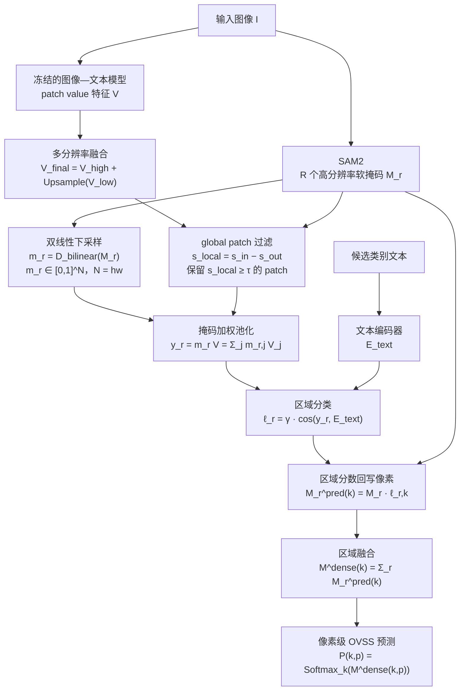

# TextRegion：论文整理版

## 1. 论文要解决什么

标准 CLIP 擅长把整张图像和文本放到同一个语义空间，但 OVSS 需要回答更细的问题：

> 图像中的哪一个区域对应哪一个类别？

只使用全局图像 embedding 会把多个物体、背景和上下文混在一起。TextRegion 的核心做法是：

1. 用区域 mask 定义候选区域；
2. 把 mask 权重下采样到视觉 patch 网格；
3. 用这些权重对 CLIP 最后的 patch value 特征做加权池化，形成 region token；
4. 用文本 embedding 对 region token 分类，再把区域类别分数广播回像素空间。

论文还讨论多尺度 token、global patch 去除以及不同区域生成方式（GT mask、SAM2、SLIC）的影响。

## 1.1 论文方法图

原始笔记中的 TextRegion 流程图保留如下；后文把图中的每个关键箭头对应到具体公式。

### 1.2 基于公式的主流程图

下面把原始笔记中的“区域生成 → patch 对齐 → 区域 token → 文本分类 → 像素回写”与整理后的公式放进同一张图。图中 `V` 表示经过多分辨率融合和 global patch 处理后的 patch value 特征矩阵。

### 1.3 流程节点与公式索引

| 图中节点 | 对应公式 | 作用 |
|---|---|---|
| SAM2 | $M_r\in[0,1]^{H_0\times W_0}$ | 在原图分辨率生成第 $r$ 个区域软掩码 |
| 双线性下采样 | $m_r=\mathcal{D}_{\mathrm{bilinear}}(M_r)$ | 把像素区域对齐到 patch 网格 |
| 多分辨率 / global patch | $V_{final}=V_{high}+\mathrm{Upsample}(V_{low})$ | 保留局部细节，并减少全局 token 对区域性的干扰 |
| 掩码加权池化 | $y_r=m_rV=\sum_{j=1}^{N}m_{r,j}V_j$ | 生成区域级视觉 token |
| 区域分类 | $\ell_r=\gamma L_2(y_r)L_2(E_{text})^{\top}$ | 在图文共享空间计算类别分数 |
| 区域回写与融合 | $M^{dense}(k)=\sum_{r=1}^{R}M_r\ell_{r,k}$ | 将区域分类结果恢复为像素级类别图 |

这张图对应后文的阅读顺序：第 2 节解释 $M_r$、$m_r$ 和 $V$，第 3 节解释 $y_r$，第 4 节解释区域 logits 到像素预测，第 5–6 节解释 global patch 和多分辨率细化。

## 2. 先把三个对象分清

### 2.1 $M_r$：高分辨率区域软掩码

第 $r$ 个候选区域的原始 mask 记为：

$$
M_r\in[0,1]^{H_0\times W_0}.
$$

它在原图分辨率上描述每个像素属于该区域的程度。若区域来自 SAM2，它是模型生成的软 mask；若来自 SLIC，它是超像素区域；若使用 GT，则是理想的上界。

### 2.2 $m_r$：patch 网格上的 mask 权重

CLIP 的 patch token 数量通常远小于原图像素数，因此要把 $M_r$ 双线性下采样到 patch 网格：

$$
m_r=\mathcal{D}_{\mathrm{bilinear}}(M_r)
\in[0,1]^{h\times w}.
$$

展平后：

$$
m_r\in\mathbb{R}^{1\times N},
\qquad N=hw.
$$

所以，$m_r$ 不是重新预测出来的类别，也不是 attention probability；它是由高分辨率区域 mask 经过 resize 得到的 patch 权重。

### 2.3 $V$：最后注意力层的 value 特征

设最后视觉注意力层输出的 patch value 特征为：

$$
V\in\mathbb{R}^{N\times C}.
$$

这里每一行 $V_j$ 对应一个 patch token 的 $C$ 维视觉特征。直观地说，$m_r$ 决定“区域 $r$ 关注哪些 patch”，而 $V$ 提供“这些 patch 的内容表示”。

> [!note] 回答“$m_r$ 负责决定类别吗？”
> 不是。$m_r$ 只决定区域内各 patch 的聚合权重；类别由 region token 与文本 embedding 的相似度决定。完整链路是 `mask weights + value features → region token → text similarity → category`。

## 3. 区域 token 的公式

论文将区域 $r$ 的 token 写成：

$$
y_r=m_rV
\in\mathbb{R}^{1\times C}.
$$

展开为：

$$
y_r=\sum_{j=1}^{N}m_{r,j}V_j.
$$

如果实现把 $m_r$ 先归一化为权重和为 1，则它是加权平均；如果没有预先归一化，它是加权和。工程上常见的稳定写法是：

$$
\bar m_r=\frac{m_r}{\sum_jm_{r,j}+\varepsilon},
\qquad
y_r=\bar m_rV,
$$

这个显式除法属于工程稳定写法；论文公式仍以 $y_r=m_rV$ 为主。

因此，你之前的理解可以精确表述为：

- $m_r$：来自区域 mask 的 patch-level 权重；
- $V$：来自最后注意力层 value 分支的 patch-level 内容特征；
- $y_r$：把区域内 patch 内容聚合成的 region token；
- 类别：由 $y_r$ 与文本类别向量的相似度决定。

## 4. 从区域 token 到密集预测

设文本类别 embedding 为：

$$
E_{text}\in\mathbb{R}^{K\times C},
$$

其中 $K$ 是类别数量。对 region token 做 L2 归一化后计算类别 logits：

$$
\ell_r=\gamma\,L_2(y_r)L_2(E_{text})^{\top}
\in\mathbb{R}^{1\times K}.
$$

逐类别写成：

$$
\ell_{r,k}=\gamma\,
\frac{y_r\cdot E_{text,k}}
{\lVert y_r\rVert_2\lVert E_{text,k}\rVert_2}.
$$

再把区域类别分数广播到原图：

$$
M_r^{\mathrm{pred}}(k)=
M_r\,\ell_{r,k}.
$$

多个候选区域叠加后得到密集类别图：

$$
M^{\mathrm{dense}}(k)=
\sum_{r=1}^{R}M_r^{\mathrm{pred}}(k).
$$

最后在类别维度进行 softmax 或按论文实现做归一化：

$$
P(k,p)=\mathrm{Softmax}_{k}
\left(M^{\mathrm{dense}}(k,p)\right).
$$

### 4.1 流程—公式对照

| 流程 | 公式 | 解释 |
|---|---|---|
| 区域生成 | $M_r$ | 高分辨率软区域 |
| 对齐视觉网格 | $m_r=\mathcal{D}_{bilinear}(M_r)$ | 把像素区域变成 patch 权重 |
| 区域聚合 | $y_r=m_rV$ | 从 patch value 得到 region token |
| 区域分类 | $\ell_r=\gamma L_2(y_r)L_2(E_{text})^\top$ | 在 CLIP 图文空间内分类 |
| 回写像素 | $M_r\ell_r$ | 把区域类别分数广播回像素 |
| 区域融合 | $\sum_{r=1}^{R}M_r\ell_r$ | 得到密集类别图 |

## 5. 为什么 patch 又被叫作 global patch

你的疑问是对的：ViT 首先把图像切成一块一块的 patch；但“patch”描述的是**输入 token 的来源**，不等于最终 token 只包含局部信息。

### 5.1 局部 patch 不等于局部语义

自注意力会让每个 patch 与其他 patch 交互。经过多层 attention 后，一个空间位置的 token 可能已经包含整张图像的上下文。因此：

- **local patch**：按空间位置对应局部图像块；
- **global patch**：在功能上带有强烈全局图像信息、对多个区域都产生相似响应的 patch/token。

“global patch”通常是论文根据相似度或响应行为作出的功能性称呼，不是说 ViT 另外切出了一种更大的物理图块，也不一定等于 `[CLS]` token。

### 5.2 TextRegion 为什么要去掉它们

如果一个 patch 对区域内和区域外都同样相似，它携带的可能是“整张图的主题/背景”而不是某个区域的独有信息。论文用区域内外相似度差异构造局部性分数，可抽象为：

$$
s_{local}=s_{in}-s_{out}.
$$

当：

$$
s_{local}<\tau,
$$

就把该 patch 视为缺乏区域特异性并抑制/移除；论文讨论的阈值约为 $\tau=0.07$。

所以“global patch”不是“快本来就不是一块一块的”，而是：**它仍然是一个 patch token，只是经过全局 self-attention 后表现得不像一个只服务于局部区域的 token。**

## 6. 多尺度特征路径

单一分辨率会在“小目标”和“大目标”之间折中。TextRegion 的多尺度思路可以写成：

$$
V_{high}=\mathrm{CLIP}(\mathrm{crop/resize}(I)),
\qquad
V_{low}=\mathrm{CLIP}(I).
$$

把低分辨率分支插值到高分辨率网格后融合：

$$
V_{final}=V_{high}+\mathrm{Upsample}(V_{low}).
$$

对部分 backbone（包括笔记中讨论的 SigLIP2/PE 设定），论文使用低分辨率分支的缩放系数，例如：

$$
V_{final}=V_{high}+0.5\,\mathrm{Upsample}(V_{low}).
$$

这不是把一张图“再切一次就自然变成全局 patch”，而是显式地同时使用局部高分辨率和整图低分辨率两条 token 路径。

## 7. 区域来源与性能上界

论文比较了三种区域来源：

| 区域来源 | 含义 | 作用 |
|---|---|---|
| GT mask | 真值区域 | 测量分类/区域 token 的上界 |
| SAM2 | 通用分割模型产生的候选区域 | 更接近实际应用 |
| SLIC | 无学习超像素 | 低成本区域基线 |

论文 Table 9 中，COCO Stuff、CLIP ViT-B/16 的 mIoU 报告为：GT 36.5、SAM2 28.7、SLIC 21.3。这个差距直接说明：

**Evidence**：区域质量会显著影响最终结果。

**Inference**：在水下任务中，SAM2/区域生成质量很可能是 TextRegion 路线的第一瓶颈；这一点可通过 GT、SAM2 和其他区域源的水下对照实验评估。

## 8. 任务与实验数字

TextRegion 同时讨论：

- open-vocabulary semantic segmentation（OVSS）；
- zero-shot referring expression comprehension（zero-shot ReC）；
- multiple-object grounding。

主表中的 backbone 对比包括 CLIP ViT-B/16 和 OpenCLIP ViT-H/14。论文报告的代表性平均结果为：

| Backbone | 平均 mIoU | ADE20K mIoU |
|---|---:|---:|
| CLIP ViT-B/16 | 46.6 | 22.8 |
| OpenCLIP ViT-H/14 | 49.5 | 27.3 |

这些数字来自论文的标准数据集，水下性能需要单独测量。

## 9. 和 E2O 的关系

### 9.1 已经明确的差异

| 方面 | E2O | TextRegion |
|---|---|---|
| 主要问题 | 水下域偏移与水下文本对齐 | 全局 CLIP 缺少区域级语义 |
| 视觉修正 | GMG 用几何自相似度传播 CLIP dense features | 用 mask 权重池化 patch value |
| 区域来源 | 核心公式不依赖 SAM2 实例 mask | SAM2/SLIC/GT 是显式区域入口 |
| 文本分支 | 水下模板 + MLLM/CSA | 类别文本 embedding |
| 输出 | 密集类别图 | region 分类再广播为密集图 |

### 9.2 组合实验设计

**Hypothesis**：E2O 的 $V_{corr}$ 可以作为 TextRegion 的 $V$，TextRegion 的 region token 也可以补充 E2O dense logits。组合实验按以下顺序展开，逐步增加变量：

1. TextRegion baseline；
2. E2O GMG + TextRegion region pooling；
3. 再加入 CSA；
4. 单独比较 SAM2、SLIC 和 GT 区域质量。

因此，区域 mask 质量应作为当前项目的待验证研究问题。

## 10. 证据、推断、假设

### Evidence

- $M_r$ 是高分辨率区域软 mask，$m_r$ 是其对齐到 patch 网格后的权重。
- $y_r=m_rV$，其中 $V$ 是最后注意力层的 value 特征矩阵。
- 区域 token 与文本 embedding 的相似度决定类别，$m_r$ 本身不决定类别。
- 多尺度、global patch 抑制以及 GT/SAM2/SLIC 区域比较是论文的主要分析点。

### Inference

- global patch 是“带全局上下文且缺乏区域特异性”的功能性称呼，不是第二种物理 patch。
- SAM2 区域质量可能成为水下使用时的主要误差源之一。

### Hypothesis

- E2O 的几何传播和 TextRegion 的区域池化可能互补，建议采用单变量消融。
