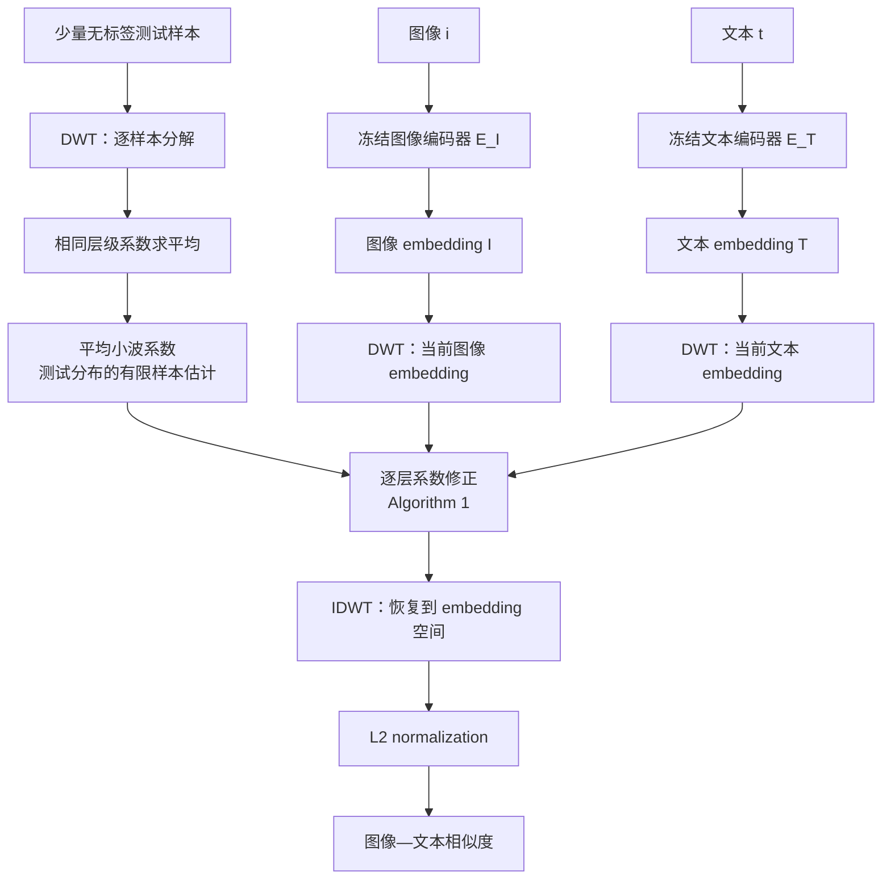

# WaveDN：论文整理版

论文题名：*WaveDN: A Wavelet-based Training-free Zero-shot Enhancement for Vision-Language Models*。论文发表于 ACM Multimedia 2024。它面向图像分类、音频分类和跨模态检索，也可作为 embedding-level 参考方法，在测试时修正视觉/文本 embedding。

> [!summary] 一句话
> WaveDN 先把 embedding 当作一维信号做离散小波分解，再用无标签测试样本估计各层平均系数，对当前样本的系数做层级修正，最后逆小波变换并计算相似度。真正产生变化的是“系数被修改”这一步；单独 DWT 后立即 IDWT 只是恒等重构。

## 1. 它在解决什么问题

CLIP 的图像和文本编码器在预训练分布上建立了对齐，但测试数据可能与预训练数据存在分布差异。WaveDN 的作者把这种差异看作 embedding 层面的分布偏移，并尝试在不更新模型参数、不使用标签的情况下，用测试样本自身的统计信息修正 embedding。

其基本约束是：

- 不训练 CLIP 或其他视觉语言模型；
- 不使用测试标签；
- 只允许用少量无标签测试样本估计统计量；
- 修改的是当前 embedding 的表示，不是模型权重。

## 2. 先看完整流程

论文中已有的流程图：

## 3. CLIP baseline 与 DN baseline

### 3.1 原始 CLIP 相似度

给定图像 $i$ 和文本 $t$：

$$
I=E_I(i),
\qquad
T=E_T(t).
$$

做 L2 归一化后，原始相似度为：

$$
M_{org}=L_2(I)^{\top}L_2(T).
$$

这里 $I,T$ 是 embedding 向量，不是原图像素，也不是类别概率图。

### 3.2 DN：更简单的 embedding 修正

论文将 DN 写成对图像、文本 embedding 做均值相关的修正：

$$
M_{DN}=
L_2\left(I-\frac12\mu_I\right)^{\top}
L_2\left(T-\frac12\mu_T\right).
$$

其中 $\mu_I,\mu_T$ 是根据测试样本估计的统计量。WaveDN 可以理解为把这种“全局修正”进一步拆成不同小波层级的修正。

## 4. embedding 到底是什么

以 CLIP 为例：

- 图像经过图像 encoder，得到一个 $d$ 维向量 $I\in\mathbb{R}^{d}$；
- 文本经过 text encoder，得到一个同维度向量 $T\in\mathbb{R}^{d}$；
- 归一化后，点积就是图像和文本的 cosine similarity。

WaveDN 把这个 $d$ 维向量暂时看成长度为 $d$ 的一维离散信号：

$$
\nu=[u_1,u_2,\ldots,u_d].
$$

这是一种处理假设：embedding 的坐标顺序本来未必具有物理上的“时间/空间邻接”意义，但小波变换可以把它分解成不同尺度的系数，因此作者用它作为一种可计算的表征重组工具。

## 5. DWT：小波系数从哪里来

### 5.1 离散小波变换

对一维 embedding $\nu$ 做离散小波变换：

$$
\mathcal{E}=\mathrm{DWT}(\nu)
=\{A_l,D_l,D_{l-1},\ldots,D_1\}.
$$

其中：

- $A_l$：第 $l$ 层的 approximation（低频/粗尺度）系数；
- $D_j$：第 $j$ 层的 detail（高频/细节）系数；
- $l$：分解层数。

所以“小波系数”不是论文凭空定义的一组额外数据，而是对 embedding 做 DWT 后由滤波器组和下采样计算得到的结果。直观上，每层都把原向量分成一个较粗的部分和一个细节部分。

### 5.2 为什么 DWT 后还要 IDWT

如果不修改系数：

$$
\nu
\xrightarrow{\mathrm{DWT}}
\mathcal{E}
\xrightarrow{\mathrm{IDWT}}
\hat\nu
\approx\nu.
$$

这只是变换域来回转换，不会产生有意义的增强。WaveDN 的核心是：

$$
\nu
\xrightarrow{\mathrm{DWT}}
\mathcal{E}
\xrightarrow{\text{系数修正}}
\mathcal{E}'
\xrightarrow{\mathrm{IDWT}}
\nu'.
$$

也就是 **DWT 和 IDWT 之间插入了数据驱动的系数修改**。

## 6. “提取平均小波分布”：估计到底在哪里

### 6.1 用无标签样本得到系数

假设从测试集合抽取 $N$ 个无标签图像 embedding $I_i$ 和文本 embedding $T_i$：

$$
A_i=\mathrm{DWT}(I_i)
 =\{\alpha_{i,1},\ldots,\alpha_{i,l+1}\},
$$

$$
B_i=\mathrm{DWT}(T_i)
 =\{\beta_{i,1},\ldots,\beta_{i,l+1}\}.
$$

每一个 $\alpha_{i,j}$ 或 $\beta_{i,j}$ 都是对应层级的一段系数向量，而不是一个类别标签。

### 6.2 相同层级求平均

图像侧各层平均系数为：

$$
A_{Avg}=\left\{
\frac1N\sum_{i=1}^{N}\alpha_{i,1},\ldots,
\frac1N\sum_{i=1}^{N}\alpha_{i,l+1}
\right\}.
$$

文本侧各层平均系数为：

$$
B_{Avg}=\left\{
\frac1N\sum_{i=1}^{N}\beta_{i,1},\ldots,
\frac1N\sum_{i=1}^{N}\beta_{i,l+1}
\right\}.
$$

### 6.3 “估计”的准确位置

未知的是整个测试分布在每个小波层级上的真实平均系数。我们无法直接看到这个无限样本平均值，于是用 $N$ 个无标签样本的有限平均去近似它：

$$
\widehat{\mu}_{A,j}
=\frac1N\sum_{i=1}^{N}\alpha_{i,j},
\qquad
\widehat{\mu}_{B,j}
=\frac1N\sum_{i=1}^{N}\beta_{i,j}.
$$

因此：

- **提取**：对每个 embedding 做 DWT，得到各层系数；
- **分布估计**：在相同层级对多个无标签样本求平均；
- **估计结果**：$A_{Avg}$ 和 $B_{Avg}$；
- 这里使用各层平均系数作为分布参照，不涉及方差或协方差估计。

> [!note] 样本数量
> 论文实验通常抽取 100 个样本，并报告约 20 个样本时相似度已达到约 97.5%，超过约 40 个样本后趋于收敛。这个数字来自论文实验设置。

## 7. “分层规划/层级归一化”：到底做了什么

这里最容易被翻译成“每层做标准归一化”，但 WaveDN 的 Algorithm 1 并不是普通的 z-score：

$$
\text{standard normalization:}
\quad
\frac{x-\mu}{\sigma};
$$

而是对每个层级执行一个基于当前系数和平均系数方向关系的修正。设：

- $x=X[i][j]$：第 $i$ 个样本在第 $j$ 层的当前系数向量；
- $y=Y[j]$：第 $j$ 层的平均系数向量；
- $\lambda$：修正强度；
- $z=x\cdot y$：当前系数与平均系数的内积。

Algorithm 1 的核心可写成：

$$
z=x\cdot y,
$$

$$
k=x-z\,y\,\lambda.
$$

对所有层级执行后得到修正系数集合 $X'$。图像侧使用 $A_{Avg}$，文本侧使用 $B_{Avg}$：

$$
A'=\mathrm{HierarchicalNorm}(A,A_{Avg}),
\qquad
B'=\mathrm{HierarchicalNorm}(B,B_{Avg}).
$$

### 7.1 这个修正如何理解

从代数形式看，$z,y$ 是沿平均系数方向的一个投影式项，$\lambda$ 控制减去多少。它会根据当前样本与层级平均方向的关系，逐层改变系数。

因此，WaveDN 在每个小波层级使用测试分布平均系数作为参照，对当前系数做方向相关的修正；它类似投影/去偏操作，与正交投影、BatchNorm 和 z-score normalization 的定义不同。

论文把这一步称为 hierarchical normalization / distribution normalization；“分层规划”更准确地指**按小波分解层级分别处理**，而不是先把全部系数混在一起再归一化。

## 8. IDWT、最终 embedding 与相似度

经过系数修正后，把完整的系数集合做逆小波变换：

$$
\widetilde I=\mathrm{IDWT}(A'),
\qquad
\widetilde T=\mathrm{IDWT}(B').
$$

这里的 IDWT 会把各层修正系数重新合成为新的图像、文本 embedding。然后归一化并计算相似度：

$$
M_{WaveDN}=L_2(\widetilde T)^{\top}L_2(\widetilde I).
$$

因此你之前概括的五步应修正为：

1. **DWT**：无标签样本和当前 embedding 都做小波分解，得到各层系数。
2. **估计**：对无标签样本的相同层级系数求平均，得到 $A_{Avg},B_{Avg}$。
3. **层级修正**：当前图像/文本系数分别依据对应平均系数执行 Algorithm 1；这不是简单的均值归一化。
4. **IDWT**：把修改后的系数重构成新的 embedding；若没有第 3 步，IDWT 基本只恢复原向量。
5. **L2 + 相似度**：对新的 image/text embedding 归一化，再计算图文相似度。

## 9. “对齐”是什么意思

WaveDN 的“对齐”指图像和文本 embedding 在小波域中分别依据测试分布参照进行修正，再回到同一 embedding 空间计算相似度：

1. 图像和文本 embedding 都被变换到小波域；
2. 图像侧用图像测试样本估计的层级参照进行修正；
3. 文本侧用文本测试样本估计的层级参照进行修正；
4. 两者再回到原 embedding 空间中计算相似度。

因此它试图降低测试分布和预训练 embedding 分布之间的表征偏移，让图像—文本相似度在测试分布上更稳定。

论文把测试相似度描述为对 InfoNCE 的 zeroth-order approximation，并将 WaveDN 解释为与训练分布对齐；这是作者的动机和解释框架。

## 10. 实现设置

| 项目 | 论文报告设置 |
|---|---|
| Wavelet | db6 |
| Decomposition level | 5 |
| 无标签样本 | 通常 100 个 |
| 重复实验 | 5 个随机种子取平均 |
| 参数更新 | 无训练、无微调、无 adapter 学习 |
| 任务 | 图像分类、音频分类、图像—文本/音频—文本检索 |

图像分类数据集包括 ImageNet、CIFAR100、Cars、SUN397、DTD、OxfordPets、Food101、Flowers102、EuroSAT 和 FGVCAircraft；音频分类包括 ESC-50、UrbanSound8K；检索实验包括 MSCOCO、Flickr30K、ESC-50 和 UrbanSound8K。

## 11. 论文报告的结果

### 11.1 图像分类

论文 Table 1 的平均结果：

| Backbone | CLIP baseline | + DN | + WaveDN |
|---|---:|---:|---:|
| CLIP ViT-B/32 | 58.35 | 59.10 | **59.66** |
| CLIP RN50 | 53.62 | 54.61 | **55.48** |
| ALBEF | — | 26.84 | **28.89** |
| TCL | — | 25.39 | **29.52** |

WaveDN 在论文平均结果上提升明显，但 Pets、Flowers 等任务仍出现类别级下降。

### 11.2 音频分类

| AudioCLIP 设置 | baseline | + DN | + WaveDN |
|---|---:|---:|---:|
| full training | 65.46 | 67.53 | **70.67** |
| partial training | 65.18 | 66.01 | **68.06** |

### 11.3 跨模态检索

MSCOCO 上，CLIP ViT-B/32 的示例结果为：

| 方向与指标 | baseline | + DN | + WaveDN |
|---|---:|---:|---:|
| Image→Text R@1 | 51.59 | 51.86 | 52.18 |
| Text→Image R@1 | 30.23 | 33.38 | 33.51 |

检索表中部分指标略低于 DN，整体收益并非每个指标都同步增加。

论文中的分类结果图：

论文中的检索结果图：

### 11.4 计算开销

论文 Table 7 报告额外开销非常小：

| Backbone | 额外 GFLOPs/图像 | 相对额外开销 |
|---|---:|---:|
| CLIP ViT-B/32 | 0.0001 | 0.0022% |
| CLIP RN50 | 0.0001 | 0.0017% |

这里的开销主要是小波域的向量操作；MLLM 推理成本另行测量。

## 12. WaveDN 用于水下 OVSS

### 12.1 可以作为什么

WaveDN 最直接适合作为 E2O/TextRegion 之外的一个 embedding-level baseline：

- 对类别文本原型做测试时系数修正；
- 对全局图像—文本相似度做无标签分布修正；
- 在不更新参数的约束下，测试水下样本是否存在可利用的 embedding 分布偏移。

### 12.2 应用时的关键设计

E2O 和 TextRegion 使用空间 token/区域 token，而 WaveDN 原论文主要处理全局 embedding。用于密集特征时，需要明确 DWT 的轴向和空间含义。

**Hypothesis**：若要用于水下 OVSS，可能需要比较至少三种轴向策略：

1. 对每个空间 token 的通道向量做 DWT；
2. 对每个通道的空间网格做二维小波变换；
3. 只对全局类别文本原型做 WaveDN，把视觉密集特征保持原状。

第一阶段保持 GMG、CSA 和区域 mask 设置不变，单独测量 WaveDN 的影响。

## 13. 批判性阅读结论

### Evidence

- 小波系数来自 embedding 的 DWT，不是额外标注。
- 平均小波系数来自少量无标签样本的相同层级求平均。
- 当前系数在 DWT 和 IDWT 之间被 Algorithm 1 修改。
- db6、5 层、约 100 个样本和五次随机种子是论文报告设置。

### Inference

- “估计”是有限样本平均对未知测试分布平均的近似。
- “分层规划/归一化”是按小波层级分别修正，不是标准 z-score。
- WaveDN 的收益可能来自测试分布统计信息，而不一定来自“小波”这一名称本身。

### Hypothesis

- embedding 坐标被当作一维信号是 WaveDN 的建模假设。
- 用 WaveDN 修正密集空间特征对局部差异的影响，需要通过空间分割消融评估。
- 水下退化可能使某些层级的系数更不稳定，该问题可用真实水下样本的层级系数统计检验。

## 相关论文

当前 Vault 中除通用的 CLIP 基础模型外，暂未建立 WaveDN 原文直接关联的专门论文笔记，因此这里不添加弱关系链接。
