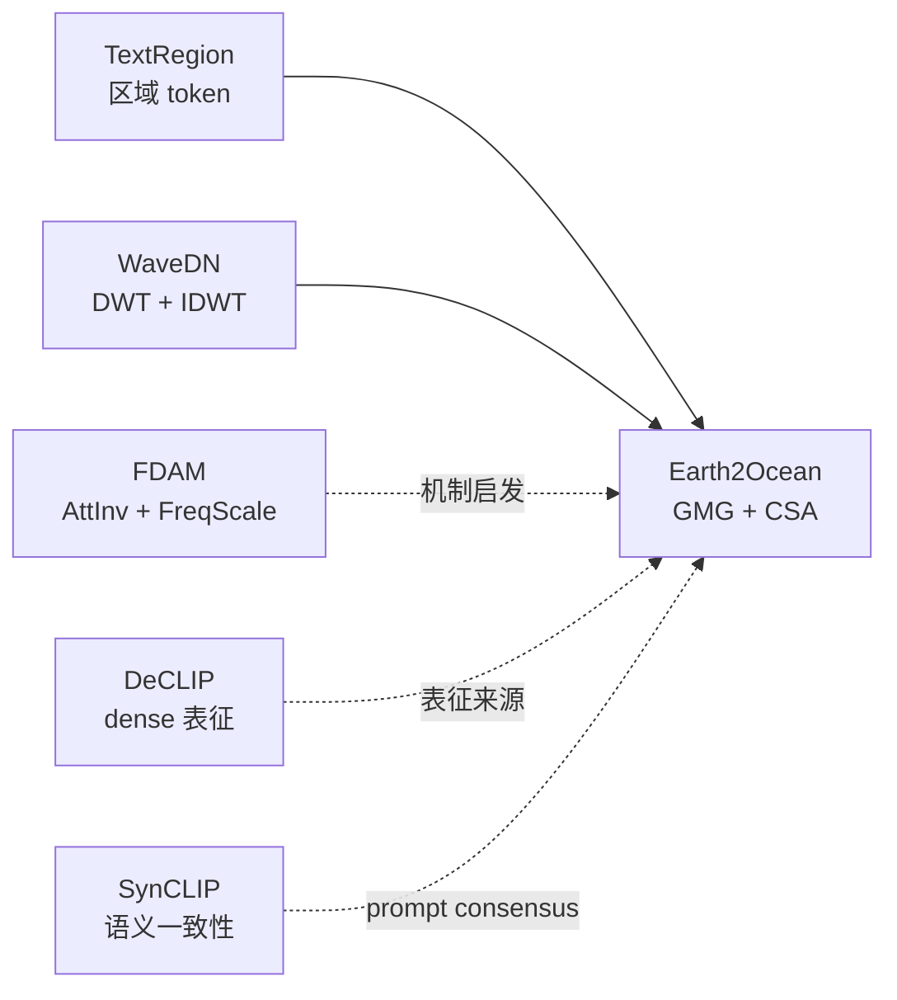

## 当前研究主线

本项目暂时不把所有方法排成一条“先后执行”的流水线，而是按它们解决的问题分成四层：

1. **冻结的预训练模型**：CLIP/OpenCLIP、SigLIP2、几何视觉基础模型以及多模态大语言模型。
2. **training-free 密集预测方法**：把全局图文表征转化为 patch、区域或像素级预测。
3. **测试时表征增强**：WaveDN 这类不更新参数、只修正 embedding 的方法。
4. **研究灵感与训练型方法**：DeCLIP、SynCLIP、FDAM 等可用于提出机制假设和实验变量。

## E2O 与五篇重点材料的关系

| 材料 | 直接解决的问题 | 核心操作 | 在研究地图中的位置 |
|---|---|---|---|
| [E2O-整理版](/lun-wen-bi-ji/e2o/) | 水下域偏移与水下类别语义对齐 | GMG 修正密集视觉特征，CSA 融合水下提示词和 MLLM 语义 | 当前项目主基线 |
| [TextRegion-整理版](/lun-wen-bi-ji/textregion/) | 全局视觉表征缺少区域级语义 | SAM2/SLIC 区域、mask pooling、多尺度 patch token | 区域级对照与潜在扩展 |
| [WaveDN-整理版](/lun-wen-bi-ji/wavedn/) | 测试分布与预训练 embedding 不匹配 | DWT、层级修正、IDWT、相似度计算 | 推理时表征增强思路 |
| [FDAM-整理版](/lun-wen-bi-ji/fdam/) | 深层 Transformer 的频率消失与过平滑 | AttInv 互补高通注意力、FreqScale 动态频谱重加权 | 训练型频率机制来源 |
| [DeCLIP-整理版](/lun-wen-bi-ji/declip/) | dense feature 的局部判别性与空间一致性不足 | 解耦 context/content，VFM 与 SD-GSC 蒸馏 | dense backbone 机制来源 |
| [SynCLIP-整理版](/lun-wen-bi-ji/synclip/) | 同义词导致密集空间响应不一致 | SSA 语义对齐、SAR 结合 DINOv2 空间关系 | 推理时 prompt consensus 来源 |

关键区分：

- E2O 的 **GMG** 利用几何自相似度修正 CLIP 的密集视觉特征。
- TextRegion 以区域掩码和区域 token 为核心，E2O 以几何引导的密集特征为核心。
- WaveDN 的 DWT/IDWT 中间包含系数修正；DWT 和 IDWT 本身负责变换与重构。
- **SCLIP** 是方法名；**SigLIP2** 是可替换的视觉语言骨干。

## 当前笔记入口

- E2O：[E2O-整理版](/lun-wen-bi-ji/e2o/)；水下提示词：[E2O-水下提示词库](/lun-wen-bi-ji/e2o-水下提示词库/)
- TextRegion：[TextRegion-整理版](/lun-wen-bi-ji/textregion/)
- WaveDN：[WaveDN-整理版](/lun-wen-bi-ji/wavedn/)
- FDAM：[FDAM-整理版](/lun-wen-bi-ji/fdam/)；直接对照方法：[MaskCLIP无监督分割实战](/dai-ma-bi-ji/maskclip无监督分割实战/)、ProxyCLIP、SCLIP、CorrCLIP、Trident
- DeCLIP：[DeCLIP-整理版](/lun-wen-bi-ji/declip/)；直接对照方法：[MaskCLIP无监督分割实战](/dai-ma-bi-ji/maskclip无监督分割实战/)、SCLIP、ClearCLIP、ProxyCLIP
- SynCLIP：[SynCLIP-整理版](/lun-wen-bi-ji/synclip/)；直接相关方法：[DeCLIP-整理版](/lun-wen-bi-ji/declip/)、DINO

## 维护约定

以后每新增一篇 `*-整理版.md`，同步完成三件事：在上表增加一行，在本节增加入口，并只补充论文正文或当前项目明确支持的强相关连接。没有强相关关系时明确写“暂无”，不为了凑网络而添加通用基础模型。

## 证据标记

- **Evidence**：能在论文、补充材料或官方代码中直接定位的事实。
- **Inference**：由论文公式、模块关系或实验结果作出的合理解释。
- **Hypothesis**：尚未验证、只用于指导下一步实验的研究假设。

后续每次增加方法或实验时，优先把这三个层次分开，避免把论文作者的动机、我们的解释和已验证结果混成同一个结论。
