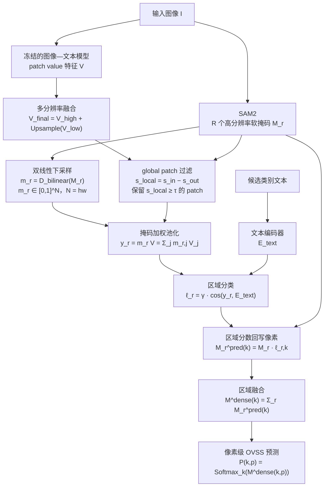
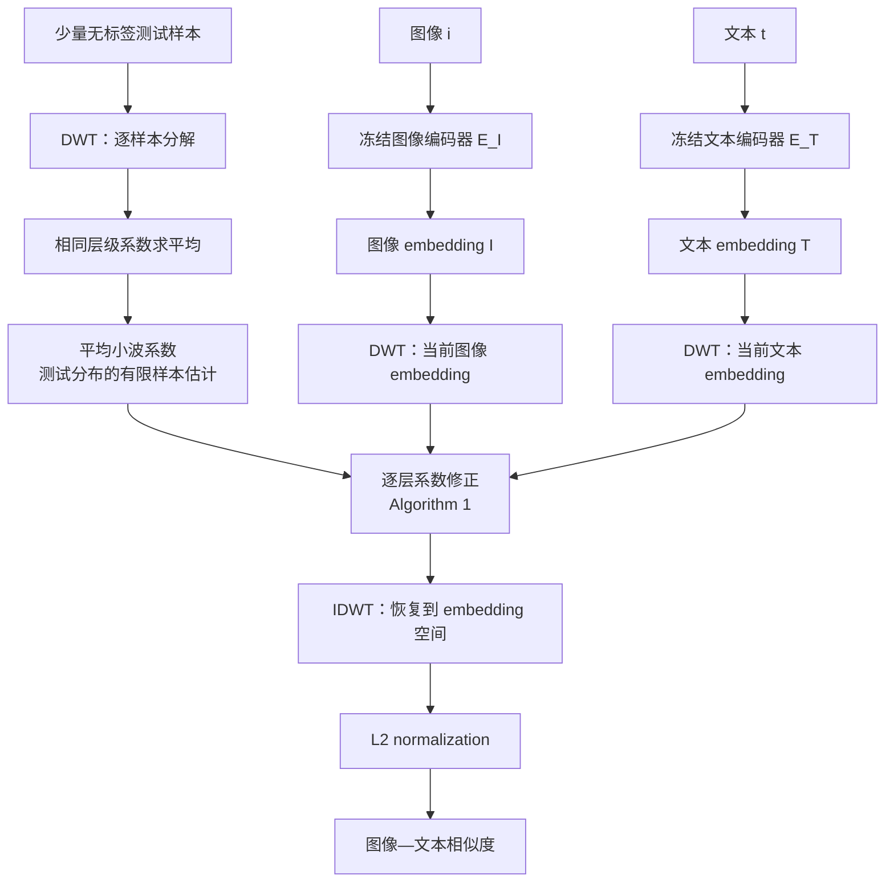
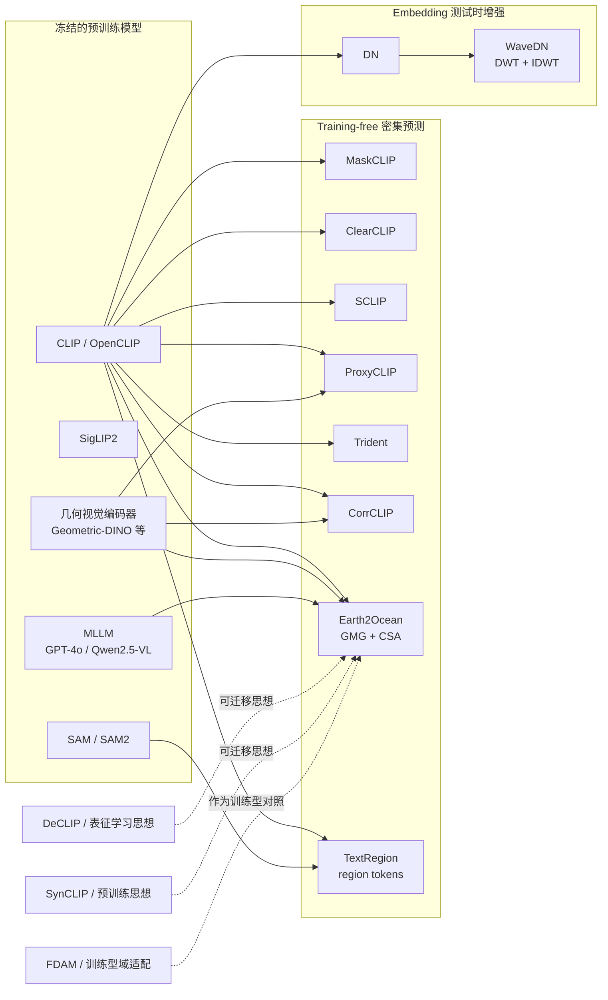

# TextRegion：论文整理版

## 1. 论文要解决什么

标准 CLIP 擅长把整张图像和文本放到同一个语义空间，但 OVSS 需要回答更细的问题：

> 图像中的哪一个区域对应哪一个类别？

只使用全局图像 embedding 会把多个物体、背景和上下文混在一起。TextRegion 的核心做法是：

1. 用区域 mask 定义候选区域；
2. 把 mask 权重下采样到视觉 patch 网格；
3. 用这些权重对 CLIP 最后的 patch value 特征做加权池化，形成 region token；
4. 用文本 embedding 对 region token 分类，再把区域类别分数广播回像素空间。

论文还讨论多尺度 token、global patch 去除以及不同区域生成方式（GT mask、SAM2、SLIC）的影响。

## 1.1 论文方法图

原始笔记中的 TextRegion 流程图保留如下；后文把图中的每个关键箭头对应到具体公式。

### 1.2 基于公式的主流程图

下面把原始笔记中的“区域生成 → patch 对齐 → 区域 token → 文本分类 → 像素回写”与整理后的公式放进同一张图。图中 `V` 表示经过多分辨率融合和 global patch 处理后的 patch value 特征矩阵。

### 1.3 流程节点与公式索引

| 图中节点 | 对应公式 | 作用 |
|---|---|---|
| SAM2 | $M_r\in[0,1]^{H_0\times W_0}$ | 在原图分辨率生成第 $r$ 个区域软掩码 |
| 双线性下采样 | $m_r=\mathcal{D}_{\mathrm{bilinear}}(M_r)$ | 把像素区域对齐到 patch 网格 |
| 多分辨率 / global patch | $V_{final}=V_{high}+\mathrm{Upsample}(V_{low})$ | 保留局部细节，并减少全局 token 对区域性的干扰 |
| 掩码加权池化 | $y_r=m_rV=\sum_{j=1}^{N}m_{r,j}V_j$ | 生成区域级视觉 token |
| 区域分类 | $\ell_r=\gamma L_2(y_r)L_2(E_{text})^{\top}$ | 在图文共享空间计算类别分数 |
| 区域回写与融合 | $M^{dense}(k)=\sum_{r=1}^{R}M_r\ell_{r,k}$ | 将区域分类结果恢复为像素级类别图 |

这张图对应后文的阅读顺序：第 2 节解释 $M_r$、$m_r$ 和 $V$，第 3 节解释 $y_r$，第 4 节解释区域 logits 到像素预测，第 5–6 节解释 global patch 和多分辨率细化。

## 2. 先把三个对象分清

### 2.1 $M_r$：高分辨率区域软掩码

第 $r$ 个候选区域的原始 mask 记为：

$$
M_r\in[0,1]^{H_0\times W_0}.
$$

它在原图分辨率上描述每个像素属于该区域的程度。若区域来自 SAM2，它是模型生成的软 mask；若来自 SLIC，它是超像素区域；若使用 GT，则是理想的上界。

### 2.2 $m_r$：patch 网格上的 mask 权重

CLIP 的 patch token 数量通常远小于原图像素数，因此要把 $M_r$ 双线性下采样到 patch 网格：

$$
m_r=\mathcal{D}_{\mathrm{bilinear}}(M_r)
\in[0,1]^{h\times w}.
$$

展平后：

$$
m_r\in\mathbb{R}^{1\times N},
\qquad N=hw.
$$

所以，$m_r$ 不是重新预测出来的类别，也不是 attention probability；它是由高分辨率区域 mask 经过 resize 得到的 patch 权重。

### 2.3 $V$：最后注意力层的 value 特征

设最后视觉注意力层输出的 patch value 特征为：

$$
V\in\mathbb{R}^{N\times C}.
$$

这里每一行 $V_j$ 对应一个 patch token 的 $C$ 维视觉特征。直观地说，$m_r$ 决定“区域 $r$ 关注哪些 patch”，而 $V$ 提供“这些 patch 的内容表示”。

> [!note] 回答“$m_r$ 负责决定类别吗？”
> 不是。$m_r$ 只决定区域内各 patch 的聚合权重；类别由 region token 与文本 embedding 的相似度决定。完整链路是 `mask weights + value features → region token → text similarity → category`。

## 3. 区域 token 的公式

论文将区域 $r$ 的 token 写成：

$$
y_r=m_rV
\in\mathbb{R}^{1\times C}.
$$

展开为：

$$
y_r=\sum_{j=1}^{N}m_{r,j}V_j.
$$

如果实现把 $m_r$ 先归一化为权重和为 1，则它是加权平均；如果没有预先归一化，它是加权和。工程上常见的稳定写法是：

$$
\bar m_r=\frac{m_r}{\sum_jm_{r,j}+\varepsilon},
\qquad
y_r=\bar m_rV,
$$

这个显式除法属于工程稳定写法；论文公式仍以 $y_r=m_rV$ 为主。

因此，你之前的理解可以精确表述为：

- $m_r$：来自区域 mask 的 patch-level 权重；
- $V$：来自最后注意力层 value 分支的 patch-level 内容特征；
- $y_r$：把区域内 patch 内容聚合成的 region token；
- 类别：由 $y_r$ 与文本类别向量的相似度决定。

## 4. 从区域 token 到密集预测

设文本类别 embedding 为：

$$
E_{text}\in\mathbb{R}^{K\times C},
$$

其中 $K$ 是类别数量。对 region token 做 L2 归一化后计算类别 logits：

$$
\ell_r=\gamma\,L_2(y_r)L_2(E_{text})^{\top}
\in\mathbb{R}^{1\times K}.
$$

逐类别写成：

$$
\ell_{r,k}=\gamma\,
\frac{y_r\cdot E_{text,k}}
{\lVert y_r\rVert_2\lVert E_{text,k}\rVert_2}.
$$

再把区域类别分数广播到原图：

$$
M_r^{\mathrm{pred}}(k)=
M_r\,\ell_{r,k}.
$$

多个候选区域叠加后得到密集类别图：

$$
M^{\mathrm{dense}}(k)=
\sum_{r=1}^{R}M_r^{\mathrm{pred}}(k).
$$

最后在类别维度进行 softmax 或按论文实现做归一化：

$$
P(k,p)=\mathrm{Softmax}_{k}
\left(M^{\mathrm{dense}}(k,p)\right).
$$

### 4.1 流程—公式对照

| 流程 | 公式 | 解释 |
|---|---|---|
| 区域生成 | $M_r$ | 高分辨率软区域 |
| 对齐视觉网格 | $m_r=\mathcal{D}_{bilinear}(M_r)$ | 把像素区域变成 patch 权重 |
| 区域聚合 | $y_r=m_rV$ | 从 patch value 得到 region token |
| 区域分类 | $\ell_r=\gamma L_2(y_r)L_2(E_{text})^\top$ | 在 CLIP 图文空间内分类 |
| 回写像素 | $M_r\ell_r$ | 把区域类别分数广播回像素 |
| 区域融合 | $\sum_{r=1}^{R}M_r\ell_r$ | 得到密集类别图 |

## 5. 为什么 patch 又被叫作 global patch

你的疑问是对的：ViT 首先把图像切成一块一块的 patch；但“patch”描述的是**输入 token 的来源**，不等于最终 token 只包含局部信息。

### 5.1 局部 patch 不等于局部语义

自注意力会让每个 patch 与其他 patch 交互。经过多层 attention 后，一个空间位置的 token 可能已经包含整张图像的上下文。因此：

- **local patch**：按空间位置对应局部图像块；
- **global patch**：在功能上带有强烈全局图像信息、对多个区域都产生相似响应的 patch/token。

“global patch”通常是论文根据相似度或响应行为作出的功能性称呼，不是说 ViT 另外切出了一种更大的物理图块，也不一定等于 `[CLS]` token。

### 5.2 TextRegion 为什么要去掉它们

如果一个 patch 对区域内和区域外都同样相似，它携带的可能是“整张图的主题/背景”而不是某个区域的独有信息。论文用区域内外相似度差异构造局部性分数，可抽象为：

$$
s_{local}=s_{in}-s_{out}.
$$

当：

$$
s_{local}<\tau,
$$

就把该 patch 视为缺乏区域特异性并抑制/移除；论文讨论的阈值约为 $\tau=0.07$。

所以“global patch”不是“快本来就不是一块一块的”，而是：**它仍然是一个 patch token，只是经过全局 self-attention 后表现得不像一个只服务于局部区域的 token。**

## 6. 多尺度特征路径

单一分辨率会在“小目标”和“大目标”之间折中。TextRegion 的多尺度思路可以写成：

$$
V_{high}=\mathrm{CLIP}(\mathrm{crop/resize}(I)),
\qquad
V_{low}=\mathrm{CLIP}(I).
$$

把低分辨率分支插值到高分辨率网格后融合：

$$
V_{final}=V_{high}+\mathrm{Upsample}(V_{low}).
$$

对部分 backbone（包括笔记中讨论的 SigLIP2/PE 设定），论文使用低分辨率分支的缩放系数，例如：

$$
V_{final}=V_{high}+0.5\,\mathrm{Upsample}(V_{low}).
$$

这不是把一张图“再切一次就自然变成全局 patch”，而是显式地同时使用局部高分辨率和整图低分辨率两条 token 路径。

## 7. 区域来源与性能上界

论文比较了三种区域来源：

| 区域来源 | 含义 | 作用 |
|---|---|---|
| GT mask | 真值区域 | 测量分类/区域 token 的上界 |
| SAM2 | 通用分割模型产生的候选区域 | 更接近实际应用 |
| SLIC | 无学习超像素 | 低成本区域基线 |

论文 Table 9 中，COCO Stuff、CLIP ViT-B/16 的 mIoU 报告为：GT 36.5、SAM2 28.7、SLIC 21.3。这个差距直接说明：

**Evidence**：区域质量会显著影响最终结果。

**Inference**：在水下任务中，SAM2/区域生成质量很可能是 TextRegion 路线的第一瓶颈；这一点可通过 GT、SAM2 和其他区域源的水下对照实验评估。

## 8. 任务与实验数字

TextRegion 同时讨论：

- open-vocabulary semantic segmentation（OVSS）；
- zero-shot referring expression comprehension（zero-shot ReC）；
- multiple-object grounding。

主表中的 backbone 对比包括 CLIP ViT-B/16 和 OpenCLIP ViT-H/14。论文报告的代表性平均结果为：

| Backbone | 平均 mIoU | ADE20K mIoU |
|---|---:|---:|
| CLIP ViT-B/16 | 46.6 | 22.8 |
| OpenCLIP ViT-H/14 | 49.5 | 27.3 |

这些数字来自论文的标准数据集，水下性能需要单独测量。

## 9. 和 E2O 的关系

### 9.1 已经明确的差异

| 方面 | E2O | TextRegion |
|---|---|---|
| 主要问题 | 水下域偏移与水下文本对齐 | 全局 CLIP 缺少区域级语义 |
| 视觉修正 | GMG 用几何自相似度传播 CLIP dense features | 用 mask 权重池化 patch value |
| 区域来源 | 核心公式不依赖 SAM2 实例 mask | SAM2/SLIC/GT 是显式区域入口 |
| 文本分支 | 水下模板 + MLLM/CSA | 类别文本 embedding |
| 输出 | 密集类别图 | region 分类再广播为密集图 |

### 9.2 组合实验设计

**Hypothesis**：E2O 的 $V_{corr}$ 可以作为 TextRegion 的 $V$，TextRegion 的 region token 也可以补充 E2O dense logits。组合实验按以下顺序展开，逐步增加变量：

1. TextRegion baseline；
2. E2O GMG + TextRegion region pooling；
3. 再加入 CSA；
4. 单独比较 SAM2、SLIC 和 GT 区域质量。

因此，区域 mask 质量应作为当前项目的待验证研究问题。

## 10. 证据、推断、假设

### Evidence

- $M_r$ 是高分辨率区域软 mask，$m_r$ 是其对齐到 patch 网格后的权重。
- $y_r=m_rV$，其中 $V$ 是最后注意力层的 value 特征矩阵。
- 区域 token 与文本 embedding 的相似度决定类别，$m_r$ 本身不决定类别。
- 多尺度、global patch 抑制以及 GT/SAM2/SLIC 区域比较是论文的主要分析点。

### Inference

- global patch 是“带全局上下文且缺乏区域特异性”的功能性称呼，不是第二种物理 patch。
- SAM2 区域质量可能成为水下使用时的主要误差源之一。

### Hypothesis

- E2O 的几何传播和 TextRegion 的区域池化可能互补，建议采用单变量消融。

# WaveDN：论文整理版

论文题名：*WaveDN: A Wavelet-based Training-free Zero-shot Enhancement for Vision-Language Models*。论文发表于 ACM Multimedia 2024。它面向图像分类、音频分类和跨模态检索，也可作为 embedding-level 参考方法，在测试时修正视觉/文本 embedding。

> [!summary] 一句话
> WaveDN 先把 embedding 当作一维信号做离散小波分解，再用无标签测试样本估计各层平均系数，对当前样本的系数做层级修正，最后逆小波变换并计算相似度。真正产生变化的是“系数被修改”这一步；单独 DWT 后立即 IDWT 只是恒等重构。

## 1. 它在解决什么问题

CLIP 的图像和文本编码器在预训练分布上建立了对齐，但测试数据可能与预训练数据存在分布差异。WaveDN 的作者把这种差异看作 embedding 层面的分布偏移，并尝试在不更新模型参数、不使用标签的情况下，用测试样本自身的统计信息修正 embedding。

其基本约束是：

- 不训练 CLIP 或其他视觉语言模型；
- 不使用测试标签；
- 只允许用少量无标签测试样本估计统计量；
- 修改的是当前 embedding 的表示，不是模型权重。

## 2. 先看完整流程

论文中已有的流程图：

## 3. CLIP baseline 与 DN baseline

### 3.1 原始 CLIP 相似度

给定图像 $i$ 和文本 $t$：

$$
I=E_I(i),
\qquad
T=E_T(t).
$$

做 L2 归一化后，原始相似度为：

$$
M_{org}=L_2(I)^{\top}L_2(T).
$$

这里 $I,T$ 是 embedding 向量，不是原图像素，也不是类别概率图。

### 3.2 DN：更简单的 embedding 修正

论文将 DN 写成对图像、文本 embedding 做均值相关的修正：

$$
M_{DN}=
L_2\left(I-\frac12\mu_I\right)^{\top}
L_2\left(T-\frac12\mu_T\right).
$$

其中 $\mu_I,\mu_T$ 是根据测试样本估计的统计量。WaveDN 可以理解为把这种“全局修正”进一步拆成不同小波层级的修正。

## 4. embedding 到底是什么

以 CLIP 为例：

- 图像经过图像 encoder，得到一个 $d$ 维向量 $I\in\mathbb{R}^{d}$；
- 文本经过 text encoder，得到一个同维度向量 $T\in\mathbb{R}^{d}$；
- 归一化后，点积就是图像和文本的 cosine similarity。

WaveDN 把这个 $d$ 维向量暂时看成长度为 $d$ 的一维离散信号：

$$
\nu=[u_1,u_2,\ldots,u_d].
$$

这是一种处理假设：embedding 的坐标顺序本来未必具有物理上的“时间/空间邻接”意义，但小波变换可以把它分解成不同尺度的系数，因此作者用它作为一种可计算的表征重组工具。

## 5. DWT：小波系数从哪里来

### 5.1 离散小波变换

对一维 embedding $\nu$ 做离散小波变换：

$$
\mathcal{E}=\mathrm{DWT}(\nu)
=\{A_l,D_l,D_{l-1},\ldots,D_1\}.
$$

其中：

- $A_l$：第 $l$ 层的 approximation（低频/粗尺度）系数；
- $D_j$：第 $j$ 层的 detail（高频/细节）系数；
- $l$：分解层数。

所以“小波系数”不是论文凭空定义的一组额外数据，而是对 embedding 做 DWT 后由滤波器组和下采样计算得到的结果。直观上，每层都把原向量分成一个较粗的部分和一个细节部分。

### 5.2 为什么 DWT 后还要 IDWT

如果不修改系数：

$$
\nu
\xrightarrow{\mathrm{DWT}}
\mathcal{E}
\xrightarrow{\mathrm{IDWT}}
\hat\nu
\approx\nu.
$$

这只是变换域来回转换，不会产生有意义的增强。WaveDN 的核心是：

$$
\nu
\xrightarrow{\mathrm{DWT}}
\mathcal{E}
\xrightarrow{\text{系数修正}}
\mathcal{E}'
\xrightarrow{\mathrm{IDWT}}
\nu'.
$$

也就是 **DWT 和 IDWT 之间插入了数据驱动的系数修改**。

## 6. “提取平均小波分布”：估计到底在哪里

### 6.1 用无标签样本得到系数

假设从测试集合抽取 $N$ 个无标签图像 embedding $I_i$ 和文本 embedding $T_i$：

$$
A_i=\mathrm{DWT}(I_i)
 =\{\alpha_{i,1},\ldots,\alpha_{i,l+1}\},
$$

$$
B_i=\mathrm{DWT}(T_i)
 =\{\beta_{i,1},\ldots,\beta_{i,l+1}\}.
$$

每一个 $\alpha_{i,j}$ 或 $\beta_{i,j}$ 都是对应层级的一段系数向量，而不是一个类别标签。

### 6.2 相同层级求平均

图像侧各层平均系数为：

$$
A_{Avg}=\left\{
\frac1N\sum_{i=1}^{N}\alpha_{i,1},\ldots,
\frac1N\sum_{i=1}^{N}\alpha_{i,l+1}
\right\}.
$$

文本侧各层平均系数为：

$$
B_{Avg}=\left\{
\frac1N\sum_{i=1}^{N}\beta_{i,1},\ldots,
\frac1N\sum_{i=1}^{N}\beta_{i,l+1}
\right\}.
$$

### 6.3 “估计”的准确位置

未知的是整个测试分布在每个小波层级上的真实平均系数。我们无法直接看到这个无限样本平均值，于是用 $N$ 个无标签样本的有限平均去近似它：

$$
\widehat{\mu}_{A,j}
=\frac1N\sum_{i=1}^{N}\alpha_{i,j},
\qquad
\widehat{\mu}_{B,j}
=\frac1N\sum_{i=1}^{N}\beta_{i,j}.
$$

因此：

- **提取**：对每个 embedding 做 DWT，得到各层系数；
- **分布估计**：在相同层级对多个无标签样本求平均；
- **估计结果**：$A_{Avg}$ 和 $B_{Avg}$；
- 这里使用各层平均系数作为分布参照，不涉及方差或协方差估计。

> [!note] 样本数量
> 论文实验通常抽取 100 个样本，并报告约 20 个样本时相似度已达到约 97.5%，超过约 40 个样本后趋于收敛。这个数字来自论文实验设置。

## 7. “分层规划/层级归一化”：到底做了什么

这里最容易被翻译成“每层做标准归一化”，但 WaveDN 的 Algorithm 1 并不是普通的 z-score：

$$
\text{standard normalization:}
\quad
\frac{x-\mu}{\sigma};
$$

而是对每个层级执行一个基于当前系数和平均系数方向关系的修正。设：

- $x=X[i][j]$：第 $i$ 个样本在第 $j$ 层的当前系数向量；
- $y=Y[j]$：第 $j$ 层的平均系数向量；
- $\lambda$：修正强度；
- $z=x\cdot y$：当前系数与平均系数的内积。

Algorithm 1 的核心可写成：

$$
z=x\cdot y,
$$

$$
k=x-z\,y\,\lambda.
$$

对所有层级执行后得到修正系数集合 $X'$。图像侧使用 $A_{Avg}$，文本侧使用 $B_{Avg}$：

$$
A'=\mathrm{HierarchicalNorm}(A,A_{Avg}),
\qquad
B'=\mathrm{HierarchicalNorm}(B,B_{Avg}).
$$

### 7.1 这个修正如何理解

从代数形式看，$z,y$ 是沿平均系数方向的一个投影式项，$\lambda$ 控制减去多少。它会根据当前样本与层级平均方向的关系，逐层改变系数。

因此，WaveDN 在每个小波层级使用测试分布平均系数作为参照，对当前系数做方向相关的修正；它类似投影/去偏操作，与正交投影、BatchNorm 和 z-score normalization 的定义不同。

论文把这一步称为 hierarchical normalization / distribution normalization；“分层规划”更准确地指**按小波分解层级分别处理**，而不是先把全部系数混在一起再归一化。

## 8. IDWT、最终 embedding 与相似度

经过系数修正后，把完整的系数集合做逆小波变换：

$$
\widetilde I=\mathrm{IDWT}(A'),
\qquad
\widetilde T=\mathrm{IDWT}(B').
$$

这里的 IDWT 会把各层修正系数重新合成为新的图像、文本 embedding。然后归一化并计算相似度：

$$
M_{WaveDN}=L_2(\widetilde T)^{\top}L_2(\widetilde I).
$$

因此你之前概括的五步应修正为：

1. **DWT**：无标签样本和当前 embedding 都做小波分解，得到各层系数。
2. **估计**：对无标签样本的相同层级系数求平均，得到 $A_{Avg},B_{Avg}$。
3. **层级修正**：当前图像/文本系数分别依据对应平均系数执行 Algorithm 1；这不是简单的均值归一化。
4. **IDWT**：把修改后的系数重构成新的 embedding；若没有第 3 步，IDWT 基本只恢复原向量。
5. **L2 + 相似度**：对新的 image/text embedding 归一化，再计算图文相似度。

## 9. “对齐”是什么意思

WaveDN 的“对齐”指图像和文本 embedding 在小波域中分别依据测试分布参照进行修正，再回到同一 embedding 空间计算相似度：

1. 图像和文本 embedding 都被变换到小波域；
2. 图像侧用图像测试样本估计的层级参照进行修正；
3. 文本侧用文本测试样本估计的层级参照进行修正；
4. 两者再回到原 embedding 空间中计算相似度。

因此它试图降低测试分布和预训练 embedding 分布之间的表征偏移，让图像—文本相似度在测试分布上更稳定。

论文把测试相似度描述为对 InfoNCE 的 zeroth-order approximation，并将 WaveDN 解释为与训练分布对齐；这是作者的动机和解释框架。

## 10. 实现设置

| 项目 | 论文报告设置 |
|---|---|
| Wavelet | db6 |
| Decomposition level | 5 |
| 无标签样本 | 通常 100 个 |
| 重复实验 | 5 个随机种子取平均 |
| 参数更新 | 无训练、无微调、无 adapter 学习 |
| 任务 | 图像分类、音频分类、图像—文本/音频—文本检索 |

图像分类数据集包括 ImageNet、CIFAR100、Cars、SUN397、DTD、OxfordPets、Food101、Flowers102、EuroSAT 和 FGVCAircraft；音频分类包括 ESC-50、UrbanSound8K；检索实验包括 MSCOCO、Flickr30K、ESC-50 和 UrbanSound8K。

## 11. 论文报告的结果

### 11.1 图像分类

论文 Table 1 的平均结果：

| Backbone | CLIP baseline | + DN | + WaveDN |
|---|---:|---:|---:|
| CLIP ViT-B/32 | 58.35 | 59.10 | **59.66** |
| CLIP RN50 | 53.62 | 54.61 | **55.48** |
| ALBEF | — | 26.84 | **28.89** |
| TCL | — | 25.39 | **29.52** |

WaveDN 在论文平均结果上提升明显，但 Pets、Flowers 等任务仍出现类别级下降。

### 11.2 音频分类

| AudioCLIP 设置 | baseline | + DN | + WaveDN |
|---|---:|---:|---:|
| full training | 65.46 | 67.53 | **70.67** |
| partial training | 65.18 | 66.01 | **68.06** |

### 11.3 跨模态检索

MSCOCO 上，CLIP ViT-B/32 的示例结果为：

| 方向与指标 | baseline | + DN | + WaveDN |
|---|---:|---:|---:|
| Image→Text R@1 | 51.59 | 51.86 | 52.18 |
| Text→Image R@1 | 30.23 | 33.38 | 33.51 |

检索表中部分指标略低于 DN，整体收益并非每个指标都同步增加。

论文中的分类结果图：

论文中的检索结果图：

### 11.4 计算开销

论文 Table 7 报告额外开销非常小：

| Backbone | 额外 GFLOPs/图像 | 相对额外开销 |
|---|---:|---:|
| CLIP ViT-B/32 | 0.0001 | 0.0022% |
| CLIP RN50 | 0.0001 | 0.0017% |

这里的开销主要是小波域的向量操作；MLLM 推理成本另行测量。

## 12. WaveDN 用于水下 OVSS

### 12.1 可以作为什么

WaveDN 最直接适合作为 E2O/TextRegion 之外的一个 embedding-level baseline：

- 对类别文本原型做测试时系数修正；
- 对全局图像—文本相似度做无标签分布修正；
- 在不更新参数的约束下，测试水下样本是否存在可利用的 embedding 分布偏移。

### 12.2 应用时的关键设计

E2O 和 TextRegion 使用空间 token/区域 token，而 WaveDN 原论文主要处理全局 embedding。用于密集特征时，需要明确 DWT 的轴向和空间含义。

**Hypothesis**：若要用于水下 OVSS，可能需要比较至少三种轴向策略：

1. 对每个空间 token 的通道向量做 DWT；
2. 对每个通道的空间网格做二维小波变换；
3. 只对全局类别文本原型做 WaveDN，把视觉密集特征保持原状。

第一阶段保持 GMG、CSA 和区域 mask 设置不变，单独测量 WaveDN 的影响。

## 13. 批判性阅读结论

### Evidence

- 小波系数来自 embedding 的 DWT，不是额外标注。
- 平均小波系数来自少量无标签样本的相同层级求平均。
- 当前系数在 DWT 和 IDWT 之间被 Algorithm 1 修改。
- db6、5 层、约 100 个样本和五次随机种子是论文报告设置。

### Inference

- “估计”是有限样本平均对未知测试分布平均的近似。
- “分层规划/归一化”是按小波层级分别修正，不是标准 z-score。
- WaveDN 的收益可能来自测试分布统计信息，而不一定来自“小波”这一名称本身。

### Hypothesis

- embedding 坐标被当作一维信号是 WaveDN 的建模假设。
- 用 WaveDN 修正密集空间特征对局部差异的影响，需要通过空间分割消融评估。
- 水下退化可能使某些层级的系数更不稳定，该问题可用真实水下样本的层级系数统计检验。
这是当前水下 training-free OVSS 研究的入口页。整理版笔记用于后续讨论、公式核对和实验设计。

## 当前研究主线

本项目暂时不把所有方法排成一条“先后执行”的流水线，而是按它们解决的问题分成四层：

1. **冻结的预训练模型**：CLIP/OpenCLIP、SigLIP2、几何视觉基础模型以及多模态大语言模型。
2. **training-free 密集预测方法**：把全局图文表征转化为 patch、区域或像素级预测。
3. **测试时表征增强**：WaveDN 这类不更新参数、只修正 embedding 的方法。
4. **研究灵感与训练型方法**：DeCLIP、SynCLIP、FDAM 等可用于提出机制假设和实验变量。

## 四篇重点材料的关系

| 材料 | 直接解决的问题 | 核心操作 | 在研究地图中的位置 |
|---|---|---|---|
| [E2O-论文整理版](/lun-wen-bi-ji/e2o-论文/) | 水下域偏移与水下类别语义对齐 | GMG 修正密集视觉特征，CSA 融合水下提示词和 MLLM 语义 | 当前项目主基线 |
| [TextRegion-整理版](/lun-wen-bi-ji/textregion/) | 全局 CLIP 难以提供可靠的区域级语义 | SAM2/SLIC 区域、mask pooling、多尺度 patch token | 区域级对照与潜在扩展 |
| [WaveDN-整理版](/lun-wen-bi-ji/wavedn/) | 测试分布与预训练 embedding 分布不匹配 | DWT、层级修正、IDWT、相似度计算 | 全局 embedding 测试时增强思路 |
| [FDAM-整理版](/lun-wen-bi-ji/fdam/) | 深层 Transformer 的频率消失与过平滑 | AttInv 互补高通注意力，FreqScale 动态频谱重加权 | 训练型机制来源与频率方向对照 |

关键区分：

- E2O 的 **GMG** 利用几何自相似度修正 CLIP 的密集视觉特征。
- TextRegion 以区域掩码和区域 token 为核心，E2O 以几何引导的密集特征为核心。
- WaveDN 的 DWT/IDWT 中间包含系数修正；DWT 和 IDWT 本身负责变换与重构。
- **SCLIP** 是方法名；**SigLIP2** 是可替换的视觉语言骨干。

## 当前笔记入口

- E2O：[E2O-论文整理版](/lun-wen-bi-ji/e2o-论文/)；水下提示词：[E2O-水下提示词库](/lun-wen-bi-ji/e2o-水下提示词库/)
- TextRegion：[TextRegion-整理版](/lun-wen-bi-ji/textregion/)
- WaveDN：[WaveDN-整理版](/lun-wen-bi-ji/wavedn/)
- FDAm：[FDAM-整理版](/lun-wen-bi-ji/fdam/)；其他关联方法：MaskCLIP复现、ProxyCLIP、SCLIP、CorrCLIP、Trident

## 证据标记

- **Evidence**：能在论文、补充材料或官方代码中直接定位的事实。
- **Inference**：由论文公式、模块关系或实验结果作出的合理解释。
- **Hypothesis**：尚未验证、只用于指导下一步实验的研究假设。

后续每次增加方法或实验时，优先把这三个层次分开，避免把论文作者的动机、我们的解释和已验证结果混成同一个结论。
